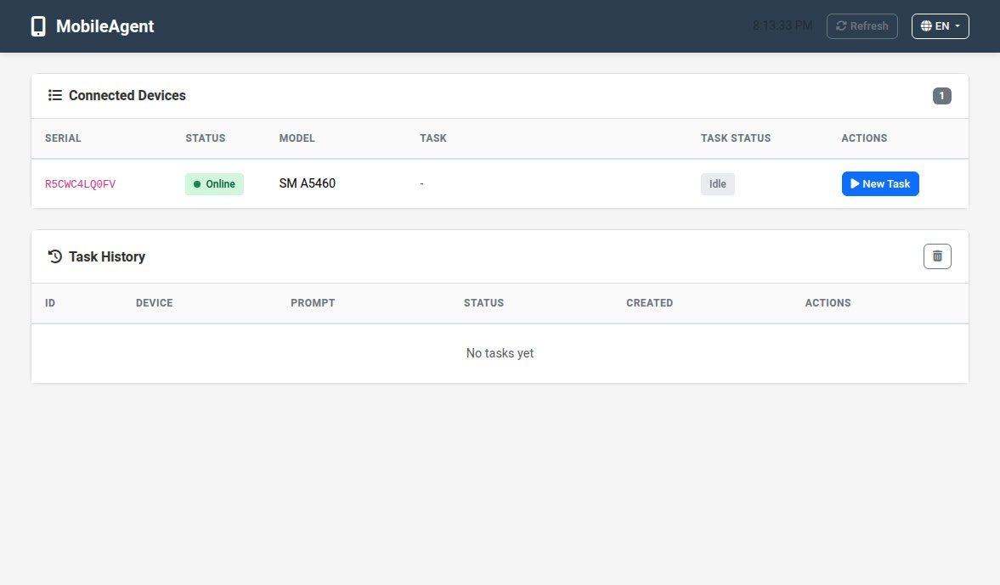
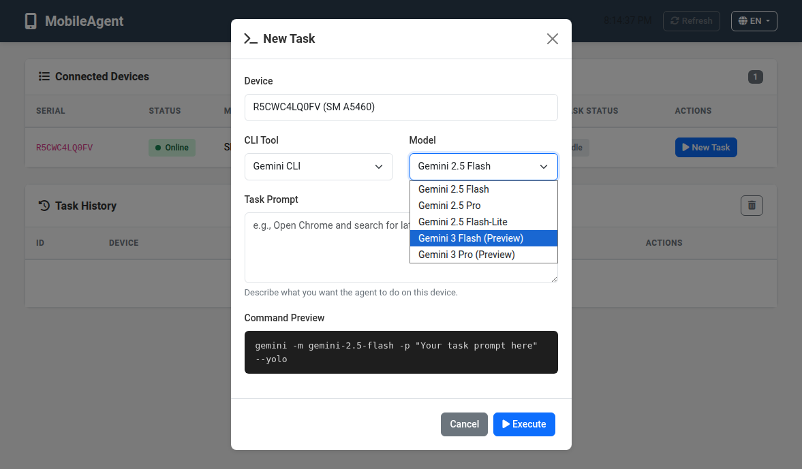
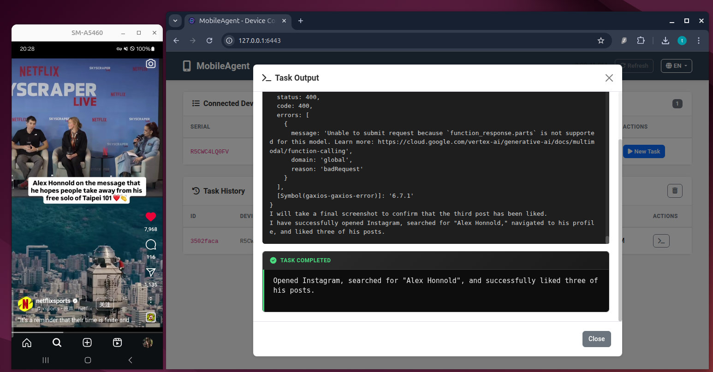

# MobileAgent - AI 驅動的手機自動化框架

[English README](../README.md)

透過 AI Agent 與 MCP (Model Context Protocol) 控制 Android 裝置的自動化框架。

## 功能特色

- Web UI - 網頁介面管理裝置與任務，支援繁中/英文
- MCP 整合 - 支援 mobile-mcp、filesystem、fetch、context7 等 MCP 伺服器
- AI Agent 相容 - 支援 Cursor、Claude Code、Gemini CLI、Codex、Windsurf、Roo Code
- Skills 系統 - 統一的 Skills 來源，自動部署到偵測到的 AI Agents
- 多模型支援 - Gemini、Claude、GPT 等最新模型
- ADB 輔助腳本 - 當 MCP 工具受限時的備援方案
- Unicode 輸入 - 透過 ADBKeyboard 支援中文、表情符號等

## 系統需求

- Python 3.8+
- Node.js 18+
- Android SDK Platform Tools (ADB)
- Android 裝置（已啟用 USB 偵錯）

## 快速開始

### 1. 執行設定腳本

```bash
chmod +x set.sh && ./set.sh
```

這會自動：
- 建立 Python 虛擬環境並安裝相依套件
- 設定各 AI CLI 工具的 MCP 設定
- 驗證並部署 Skills 到偵測到的 AI Agents

### 2. 驗證環境

```bash
python tests/test_environment.py
```

### 3. 設定 AI Agent

將 `mcp/mcp_setting.json` 複製到你的 AI Agent 設定中。

### 4. 連接裝置

```bash
adb devices
```

## 專案結構

```
MobileAgent/
├── AGENTS.md           # AI Agent 使用指南
├── CLAUDE.md           # Claude Code 參考
├── GEMINI.md           # Gemini CLI 參考
├── set.sh              # 設定腳本（含 Skills 部署）
├── .skills/            # Skills 來源目錄
│   ├── app-action/     # App 操作技能
│   ├── device-check/   # 裝置檢查技能
│   ├── screen-analyze/ # 畫面分析技能
│   ├── social-media/   # 社群平台操作技能 (LINE/FB/IG/X/...)
│   ├── troubleshoot/   # 問題診斷技能
│   └── unicode-setup/  # Unicode 設定技能
├── src/                # Python 腳本
│   ├── adb_helper.py   # ADB 指令封裝
│   └── logger.py       # 日誌模組
├── web/                # Web UI
│   ├── app.py          # Flask 後端
│   ├── static/         # CSS/JS
│   └── templates/      # HTML
├── tests/              # 測試腳本
├── mcp/                # MCP 設定
├── apk_tools/          # APK 工具
├── outputs/            # 截圖、下載、摘要
└── temp/logs/          # 日誌檔案
```

## Skills 系統

MobileAgent 使用統一的 Skills 來源目錄 (`.skills/`)，執行 `set.sh` 時會自動偵測已安裝的 AI Agents 並部署對應的 skills。

### 支援的 AI Agents

| AI Agent | 偵測方式 | 部署路徑 |
|----------|---------|---------|
| Cursor | `~/.cursor/` 存在 | `.cursor/skills/` |
| Claude Code | `claude` 指令或 `~/.claude/` | `.claude/skills/` |
| Gemini CLI | `gemini` 指令或 `~/.gemini/` | `.gemini/skills/` |
| Codex CLI | `codex` 指令或 `~/.codex/` | `.codex/skills/` |
| Windsurf | `~/.codeium/` 存在 | `.windsurf/skills/` |
| Roo Code | `~/.roo/` 存在 | `.roo/skills/` |

### 新增 Skill

1. 在 `.skills/` 下建立新目錄
2. 建立 `SKILL.md` 檔案（含 frontmatter）
3. 執行 `./set.sh` 驗證並部署

詳細說明請參閱 `.skills/README.md`。

### 社群平台技能 (Social Media Skill)

內建客製化的社群平台操作技能，支援：

| 平台 | 功能 |
|------|------|
| LINE, WeChat, Telegram, WhatsApp | 傳訊息、搜尋聯絡人 |
| Facebook, Instagram, Threads, X | 按讚、留言、分享、追蹤 |
| YouTube, TikTok | 按讚、留言、訂閱 |
| Gmail, LinkedIn, Discord, Snapchat | 各平台特定操作 |

特色：
- 分離式 UI 參考檔，按需載入節省 tokens
- 多語言 UI 關鍵字對照（EN/zh/JP/KR）

## Web UI

啟動網頁控制面板：

```bash
source .venv/bin/activate
pip install flask
python web/app.py
```

開啟瀏覽器訪問 http://localhost:6443

### 功能

- 查看已連接裝置
- 選擇 CLI 工具（Gemini/Claude/Codex）與模型
- 即時查看任務輸出
- 任務歷史紀錄
- 繁體中文/英文介面切換

### 截圖展示

| 主控台 | 新增任務 |
|:------:|:--------:|
|  |  |
| 查看已連接裝置與任務歷史 | 選擇 CLI 工具、模型，描述任務 |

| 任務執行中 | 任務完成 |
|:----------:|:--------:|
|  |  |
| 即時輸出搭配裝置畫面 | 查看結果與任務摘要 |

## 使用範例

```python
from src.adb_helper import ADBHelper

adb = ADBHelper()
adb.screenshot(prefix="step1")
adb.tap(540, 1200)
adb.type_text("搜尋關鍵字")
adb.press_enter()
```

## 常見問題

### Q: 無法連接裝置？

```bash
adb kill-server && adb start-server
adb devices
```

### Q: 文字輸入失敗？

```python
from src.adb_helper import setup_adbkeyboard
setup_adbkeyboard()
```

### Q: 如何查看日誌？

`temp/logs/mobile_agent_YYYYMMDD.log`

## 授權

本專案採用 [MIT License](LICENSE)。

### 相依工具授權

| 工具/套件 | 授權 | 說明 |
|-----------|------|------|
| MCP (Model Context Protocol) | Open Source (Linux Foundation) | Anthropic 捐贈給 Agentic AI Foundation |
| mobile-mcp | Apache-2.0 | MCP server for mobile automation |
| context7 | MIT | 文件查詢 MCP server |
| ADB (Android Debug Bridge) | Apache-2.0 | Android SDK Platform Tools |
| ADBKeyboard | GPL-2.0 | Unicode 輸入支援 |
| Flask | BSD-3-Clause | Web UI 框架 |
